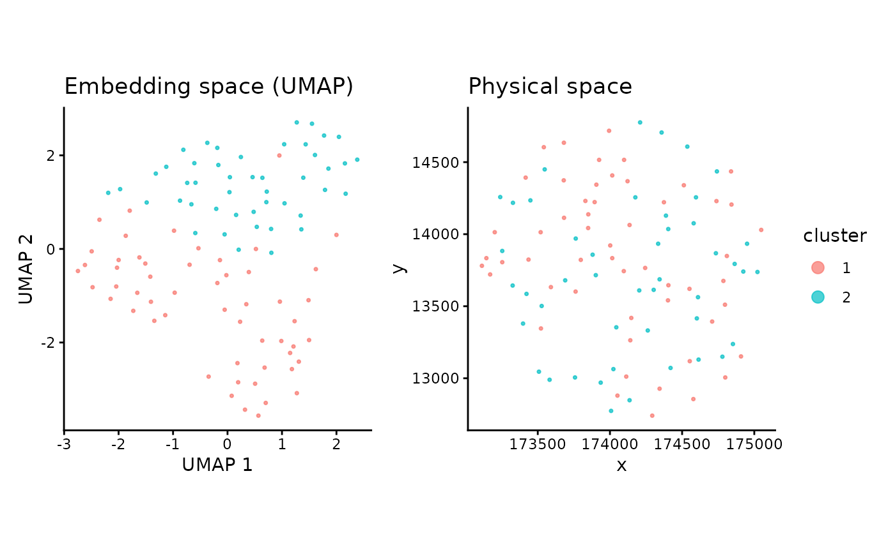

# Running Nicheformer foundational model

Abstract

This package takes an h5ad file with the gene count matrix and spatial
coordinates as input, runs Nicheformer, creating the Python environment
automatically, and returns a matrix with the embeddings.

Loading the necessary packages to run `Nicheformer` in R

``` r

library(anndataR)
library(fomo)
library(SpatialExperiment)
```

    ## Loading required package: SingleCellExperiment

    ## Loading required package: SummarizedExperiment

    ## Loading required package: MatrixGenerics

    ## Loading required package: matrixStats

    ## 
    ## Attaching package: 'MatrixGenerics'

    ## The following objects are masked from 'package:matrixStats':
    ## 
    ##     colAlls, colAnyNAs, colAnys, colAvgsPerRowSet, colCollapse,
    ##     colCounts, colCummaxs, colCummins, colCumprods, colCumsums,
    ##     colDiffs, colIQRDiffs, colIQRs, colLogSumExps, colMadDiffs,
    ##     colMads, colMaxs, colMeans2, colMedians, colMins, colOrderStats,
    ##     colProds, colQuantiles, colRanges, colRanks, colSdDiffs, colSds,
    ##     colSums2, colTabulates, colVarDiffs, colVars, colWeightedMads,
    ##     colWeightedMeans, colWeightedMedians, colWeightedSds,
    ##     colWeightedVars, rowAlls, rowAnyNAs, rowAnys, rowAvgsPerColSet,
    ##     rowCollapse, rowCounts, rowCummaxs, rowCummins, rowCumprods,
    ##     rowCumsums, rowDiffs, rowIQRDiffs, rowIQRs, rowLogSumExps,
    ##     rowMadDiffs, rowMads, rowMaxs, rowMeans2, rowMedians, rowMins,
    ##     rowOrderStats, rowProds, rowQuantiles, rowRanges, rowRanks,
    ##     rowSdDiffs, rowSds, rowSums2, rowTabulates, rowVarDiffs, rowVars,
    ##     rowWeightedMads, rowWeightedMeans, rowWeightedMedians,
    ##     rowWeightedSds, rowWeightedVars

    ## Loading required package: GenomicRanges

    ## Loading required package: stats4

    ## Loading required package: BiocGenerics

    ## Loading required package: generics

    ## 
    ## Attaching package: 'generics'

    ## The following objects are masked from 'package:base':
    ## 
    ##     as.difftime, as.factor, as.ordered, intersect, is.element, setdiff,
    ##     setequal, union

    ## 
    ## Attaching package: 'BiocGenerics'

    ## The following objects are masked from 'package:stats':
    ## 
    ##     IQR, mad, sd, var, xtabs

    ## The following objects are masked from 'package:base':
    ## 
    ##     anyDuplicated, aperm, append, as.data.frame, basename, cbind,
    ##     colnames, dirname, do.call, duplicated, eval, evalq, Filter, Find,
    ##     get, grep, grepl, is.unsorted, lapply, Map, mapply, match, mget,
    ##     order, paste, pmax, pmax.int, pmin, pmin.int, Position, rank,
    ##     rbind, Reduce, rownames, sapply, saveRDS, table, tapply, unique,
    ##     unsplit, which.max, which.min

    ## Loading required package: S4Vectors

    ## 
    ## Attaching package: 'S4Vectors'

    ## The following object is masked from 'package:utils':
    ## 
    ##     findMatches

    ## The following objects are masked from 'package:base':
    ## 
    ##     expand.grid, I, unname

    ## Loading required package: IRanges

    ## Loading required package: Seqinfo

    ## Loading required package: Biobase

    ## Welcome to Bioconductor
    ## 
    ##     Vignettes contain introductory material; view with
    ##     'browseVignettes()'. To cite Bioconductor, see
    ##     'citation("Biobase")', and for packages 'citation("pkgname")'.

    ## 
    ## Attaching package: 'Biobase'

    ## The following object is masked from 'package:MatrixGenerics':
    ## 
    ##     rowMedians

    ## The following objects are masked from 'package:matrixStats':
    ## 
    ##     anyMissing, rowMedians

Preparing the annDataR object

``` r

spe <- readRDS(
  system.file("extdata", "CosMx1k_MouseBrain1_100tx_100cl.rds", package = "fomo")
)

spatialCoords(spe) |> as.data.frame() -> coords_df
colData(spe)$x_coord <- coords_df[, 1]
colData(spe)$y_coord <- coords_df[, 2]
reducedDim(spe, "spatial") <- as.matrix(spatialCoords(spe))
```

    ## Warning in .check_reddim_names(x, value, withDimnames): non-NULL 'rownames(value)' should be the same as 'colnames(x)' for
    ## 'reducedDim<-'. This will be an error in the next release of
    ## Bioconductor.

``` r

adata <- as_AnnData(spe)
colnames(adata$obsm$spatial) <- c("x_coord", "y_coord")
```

Here, we are using a mouse cosmx-based example with gene symbols as
variable names. However, `Nicheformer` requires human Ensembl IDs.
Therefore, this chunk retrieves and replaces the orthologues

``` r

library(homologene)
library(org.Hs.eg.db)
```

    ## Loading required package: AnnotationDbi

    ## 

``` r

library(AnnotationDbi)

gene_symbols <- adata$var_names

# mouse (taxid 10090) -> human (taxid 9606) ortholog symbols
orthologs <- homologene(gene_symbols, inTax = 10090, outTax = 9606)
# columns: "10090" (mouse symbol), "9606" (human symbol)

# human symbol -> human Ensembl ID
human_ensembl <- mapIds(
  org.Hs.eg.db,
  keys      = orthologs[["9606"]],
  column    = "ENSEMBL",
  keytype   = "SYMBOL",
  multiVals = "first"
)
```

    ## 'select()' returned 1:many mapping between keys and columns

``` r

orthologs$ensembl_id <- human_ensembl[orthologs[["9606"]]]

# match back to original gene order
new_names <- ifelse(
  gene_symbols %in% orthologs[["10090"]],
  orthologs$ensembl_id[match(gene_symbols, orthologs[["10090"]])],
  gene_symbols
)

# keep only valid Ensembl IDs (start with ENSG) and not duplicated
is_ensembl  <- grepl("^ENSG", new_names)
is_unique   <- !duplicated(new_names)
keep        <- is_ensembl & is_unique

message(sum(keep), " genes kept out of ", length(new_names))
```

    ## 896 genes kept out of 960

``` r

adata <- adata[, keep]$as_InMemoryAnnData()
rownames(adata$var) <- new_names[keep]
```

Generating the `h5ad` file and running `Nicheformer` in R

``` r

# write anndata to tempfile 
adata$write_h5ad(
  tp <- tempfile(fileext = ".h5ad"), 
  mode = "w"
)
```

    ## Warning: Matrix column names cannot be written to a <HDF5AnnData> object, they will be
    ## lost
    ## ℹ To write column names for obsm[['spatial']], store it as <data.frame> instead
    ##   of a double matrix
    ## ℹ NOTE: obs_names and var_names are stored separately

``` r

nicheformer_data <- Run_nicheformer(adata_path = tp,
                                  technology = "cosmx")
```

    ## Installing pyenv ...
    ## Done! pyenv has been installed to '/home/runner/.local/share/r-reticulate/pyenv/bin/pyenv'.
    ## Using Python: /home/runner/.pyenv/versions/3.10.0/bin/python3.10
    ## Creating virtual environment '/home/runner/.cache/R/basilisk/1.24.0/fomo/0.1.0/nicheformer' ...

    ## + /home/runner/.pyenv/versions/3.10.0/bin/python3.10 -m venv /home/runner/.cache/R/basilisk/1.24.0/fomo/0.1.0/nicheformer

    ## Done!
    ## Installing packages: pip, wheel, setuptools

    ## + /home/runner/.cache/R/basilisk/1.24.0/fomo/0.1.0/nicheformer/bin/python -m pip install --upgrade pip wheel setuptools

    ## Installing packages: 'transformers==4.57.6', 'tiktoken==0.9.0', 'sentencepiece==0.2.1', 'git+https://github.com/theislab/nicheformer.git@485cadbc5caa15119adfd54228f8a8af835fcabc'

    ## + /home/runner/.cache/R/basilisk/1.24.0/fomo/0.1.0/nicheformer/bin/python -m pip install --upgrade --no-user 'transformers==4.57.6' 'tiktoken==0.9.0' 'sentencepiece==0.2.1' 'git+https://github.com/theislab/nicheformer.git@485cadbc5caa15119adfd54228f8a8af835fcabc'

    ## Virtual environment '/home/runner/.cache/R/basilisk/1.24.0/fomo/0.1.0/nicheformer' successfully created.
    ## Using provided technology mean array with shape (20310,)
    ## [1] "cpu"
    ## Using device: cpu
    ## Embeddings shape: [100, 512]

Downstream analysis using the embeddings to calculate clusters using a
graph-based approach

``` r

library(ggplot2)
library(uwot)
```

    ## Loading required package: Matrix

    ## 
    ## Attaching package: 'Matrix'

    ## The following object is masked from 'package:S4Vectors':
    ## 
    ##     expand

``` r

library(bluster)
library(cluster)     
library(patchwork)
library(dplyr)
```

    ## 
    ## Attaching package: 'dplyr'

    ## The following object is masked from 'package:AnnotationDbi':
    ## 
    ##     select

    ## The following object is masked from 'package:Biobase':
    ## 
    ##     combine

    ## The following objects are masked from 'package:GenomicRanges':
    ## 
    ##     intersect, setdiff, union

    ## The following object is masked from 'package:Seqinfo':
    ## 
    ##     intersect

    ## The following objects are masked from 'package:IRanges':
    ## 
    ##     collapse, desc, intersect, setdiff, slice, union

    ## The following objects are masked from 'package:S4Vectors':
    ## 
    ##     first, intersect, rename, setdiff, setequal, union

    ## The following objects are masked from 'package:BiocGenerics':
    ## 
    ##     combine, intersect, setdiff, setequal, union

    ## The following object is masked from 'package:generics':
    ## 
    ##     explain

    ## The following object is masked from 'package:matrixStats':
    ## 
    ##     count

    ## The following objects are masked from 'package:stats':
    ## 
    ##     filter, lag

    ## The following objects are masked from 'package:base':
    ## 
    ##     intersect, setdiff, setequal, union

``` r

set.seed(1234)

data_for_clustering <- nicheformer_data

leiden_clusters <- clusterRows(
    data_for_clustering,
    NNGraphParam(
        k             = 30,
        type          = "jaccard",        
        cluster.fun   = "leiden",
        cluster.args  = list(
            resolution_parameter = 1.0,  
            objective_function   = "modularity"
        )
    )
)

n_clusters <- length(unique(leiden_clusters))
message(sprintf("Leiden found %d clusters", n_clusters))
```

    ## Leiden found 2 clusters

``` r

umap_2d <- umap(
    data_for_clustering,
    n_components = 2,
    n_neighbors  = 30,
    min_dist     = 0.3,
    metric       = "cosine"   
)

plot_df <- data.frame(
    umap1   = umap_2d[, 1],
    umap2   = umap_2d[, 2],
    x       = adata$obs$x_coord,
    y       = adata$obs$y_coord,
    cluster = factor(leiden_clusters)
)

p_umap <- ggplot(plot_df, aes(umap1, umap2, color = cluster)) +
    geom_point(size = 0.6, alpha = 0.7) +
    theme_classic() +
    labs(title = "Embedding space (UMAP)", x = "UMAP 1", y = "UMAP 2") +
    guides(color = guide_legend(override.aes = list(size = 3)))

p_spatial <- ggplot(plot_df, aes(x, y, color = cluster)) +
    geom_point(size = 0.6, alpha = 0.7) +
    coord_fixed() +
    theme_classic() +
    labs(title = "Physical space", x = "x", y = "y") +
    guides(color = guide_legend(override.aes = list(size = 3)))

p_umap + p_spatial + plot_layout(guides = "collect")
```



``` r

sessionInfo()
```

    ## R version 4.6.1 (2026-06-24)
    ## Platform: x86_64-pc-linux-gnu
    ## Running under: Ubuntu 24.04.4 LTS
    ## 
    ## Matrix products: default
    ## BLAS:   /usr/lib/x86_64-linux-gnu/openblas-pthread/libblas.so.3 
    ## LAPACK: /usr/lib/x86_64-linux-gnu/openblas-pthread/libopenblasp-r0.3.26.so;  LAPACK version 3.12.0
    ## 
    ## locale:
    ##  [1] LC_CTYPE=C.UTF-8       LC_NUMERIC=C           LC_TIME=C.UTF-8       
    ##  [4] LC_COLLATE=C.UTF-8     LC_MONETARY=C.UTF-8    LC_MESSAGES=C.UTF-8   
    ##  [7] LC_PAPER=C.UTF-8       LC_NAME=C              LC_ADDRESS=C          
    ## [10] LC_TELEPHONE=C         LC_MEASUREMENT=C.UTF-8 LC_IDENTIFICATION=C   
    ## 
    ## time zone: UTC
    ## tzcode source: system (glibc)
    ## 
    ## attached base packages:
    ## [1] stats4    stats     graphics  grDevices utils     datasets  methods  
    ## [8] base     
    ## 
    ## other attached packages:
    ##  [1] dplyr_1.2.1                 patchwork_1.3.2            
    ##  [3] cluster_2.1.8.2             bluster_1.22.0             
    ##  [5] uwot_0.2.4                  Matrix_1.7-5               
    ##  [7] ggplot2_4.0.3               org.Hs.eg.db_3.23.1        
    ##  [9] AnnotationDbi_1.74.0        homologene_1.4.68.19.3.27  
    ## [11] SpatialExperiment_1.22.0    SingleCellExperiment_1.34.0
    ## [13] SummarizedExperiment_1.42.0 Biobase_2.72.0             
    ## [15] GenomicRanges_1.64.0        Seqinfo_1.2.0              
    ## [17] IRanges_2.46.0              S4Vectors_0.50.1           
    ## [19] BiocGenerics_0.58.1         generics_0.1.4             
    ## [21] MatrixGenerics_1.24.0       matrixStats_1.5.0          
    ## [23] fomo_0.1.0                  anndataR_1.2.0             
    ## 
    ## loaded via a namespace (and not attached):
    ##  [1] tidyselect_1.2.1    farver_2.1.2        blob_1.3.0         
    ##  [4] S7_0.2.2            filelock_1.0.3      Biostrings_2.80.1  
    ##  [7] fastmap_1.2.0       digest_0.6.39       lifecycle_1.0.5    
    ## [10] KEGGREST_1.52.2     RSQLite_3.53.2      magrittr_2.0.5     
    ## [13] compiler_4.6.1      rlang_1.2.0         sass_0.4.10        
    ## [16] tools_4.6.1         igraph_2.3.3        yaml_2.3.12        
    ## [19] knitr_1.51          labeling_0.4.3      S4Arrays_1.12.0    
    ## [22] bit_4.6.0           reticulate_1.46.0   DelayedArray_0.38.2
    ## [25] RColorBrewer_1.1-3  BiocParallel_1.46.0 abind_1.4-8        
    ## [28] withr_3.0.3         purrr_1.2.2         desc_1.4.3         
    ## [31] grid_4.6.1          Rhdf5lib_2.0.0      scales_1.4.0       
    ## [34] cli_3.6.6           rmarkdown_2.31      crayon_1.5.3       
    ## [37] ragg_1.5.2          otel_0.2.0          RSpectra_0.16-2    
    ## [40] httr_1.4.8          rjson_0.2.23        DBI_1.3.0          
    ## [43] cachem_1.1.0        rhdf5_2.56.0        parallel_4.6.1     
    ## [46] XVector_0.52.0      basilisk_1.24.0     vctrs_0.7.3        
    ## [49] jsonlite_2.0.0      dir.expiry_1.20.0   BiocNeighbors_2.6.0
    ## [52] bit64_4.8.2         systemfonts_1.3.2   magick_2.9.1       
    ## [55] jquerylib_0.1.4     glue_1.8.1          pkgdown_2.2.0      
    ## [58] codetools_0.2-20    RcppAnnoy_0.0.23    gtable_0.3.6       
    ## [61] tibble_3.3.1        pillar_1.11.1       rappdirs_0.3.4     
    ## [64] htmltools_0.5.9     rhdf5filters_1.24.0 R6_2.6.1           
    ## [67] textshaping_1.0.5   evaluate_1.0.5      lattice_0.22-9     
    ## [70] png_0.1-9           memoise_2.0.1       bslib_0.11.0       
    ## [73] Rcpp_1.1.1-1.1      SparseArray_1.12.2  xfun_0.59          
    ## [76] fs_2.1.0            pkgconfig_2.0.3
