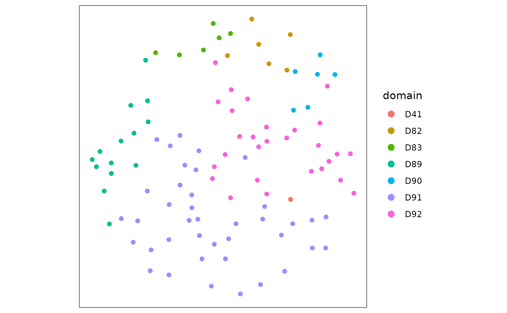

# Running Novae foundational model

Abstract

This package takes an h5ad file with the gene count matrix and spatial
coordinates as input, runs Novae, creating the Python environment
automatically, and returns an annDataR object with the embeddings and
domains (spatial clusters).

``` r

library(anndataR)
library(SpatialExperiment)
```

    ## Loading required package: SingleCellExperiment

    ## Loading required package: SummarizedExperiment

    ## Loading required package: MatrixGenerics

    ## Loading required package: matrixStats

    ## 
    ## Attaching package: 'MatrixGenerics'

    ## The following objects are masked from 'package:matrixStats':
    ## 
    ##     colAlls, colAnyNAs, colAnys, colAvgsPerRowSet, colCollapse,
    ##     colCounts, colCummaxs, colCummins, colCumprods, colCumsums,
    ##     colDiffs, colIQRDiffs, colIQRs, colLogSumExps, colMadDiffs,
    ##     colMads, colMaxs, colMeans2, colMedians, colMins, colOrderStats,
    ##     colProds, colQuantiles, colRanges, colRanks, colSdDiffs, colSds,
    ##     colSums2, colTabulates, colVarDiffs, colVars, colWeightedMads,
    ##     colWeightedMeans, colWeightedMedians, colWeightedSds,
    ##     colWeightedVars, rowAlls, rowAnyNAs, rowAnys, rowAvgsPerColSet,
    ##     rowCollapse, rowCounts, rowCummaxs, rowCummins, rowCumprods,
    ##     rowCumsums, rowDiffs, rowIQRDiffs, rowIQRs, rowLogSumExps,
    ##     rowMadDiffs, rowMads, rowMaxs, rowMeans2, rowMedians, rowMins,
    ##     rowOrderStats, rowProds, rowQuantiles, rowRanges, rowRanks,
    ##     rowSdDiffs, rowSds, rowSums2, rowTabulates, rowVarDiffs, rowVars,
    ##     rowWeightedMads, rowWeightedMeans, rowWeightedMedians,
    ##     rowWeightedSds, rowWeightedVars

    ## Loading required package: GenomicRanges

    ## Loading required package: stats4

    ## Loading required package: BiocGenerics

    ## Loading required package: generics

    ## 
    ## Attaching package: 'generics'

    ## The following objects are masked from 'package:base':
    ## 
    ##     as.difftime, as.factor, as.ordered, intersect, is.element, setdiff,
    ##     setequal, union

    ## 
    ## Attaching package: 'BiocGenerics'

    ## The following objects are masked from 'package:stats':
    ## 
    ##     IQR, mad, sd, var, xtabs

    ## The following objects are masked from 'package:base':
    ## 
    ##     anyDuplicated, aperm, append, as.data.frame, basename, cbind,
    ##     colnames, dirname, do.call, duplicated, eval, evalq, Filter, Find,
    ##     get, grep, grepl, is.unsorted, lapply, Map, mapply, match, mget,
    ##     order, paste, pmax, pmax.int, pmin, pmin.int, Position, rank,
    ##     rbind, Reduce, rownames, sapply, saveRDS, table, tapply, unique,
    ##     unsplit, which.max, which.min

    ## Loading required package: S4Vectors

    ## 
    ## Attaching package: 'S4Vectors'

    ## The following object is masked from 'package:utils':
    ## 
    ##     findMatches

    ## The following objects are masked from 'package:base':
    ## 
    ##     expand.grid, I, unname

    ## Loading required package: IRanges

    ## Loading required package: Seqinfo

    ## Loading required package: Biobase

    ## Welcome to Bioconductor
    ## 
    ##     Vignettes contain introductory material; view with
    ##     'browseVignettes()'. To cite Bioconductor, see
    ##     'citation("Biobase")', and for packages 'citation("pkgname")'.

    ## 
    ## Attaching package: 'Biobase'

    ## The following object is masked from 'package:MatrixGenerics':
    ## 
    ##     rowMedians

    ## The following objects are masked from 'package:matrixStats':
    ## 
    ##     anyMissing, rowMedians

``` r

library(fomo)

spe <- readRDS(
  system.file("extdata", "CosMx1k_MouseBrain1_100tx_100cl.rds", package = "fomo")
)
```

Prepare h5ad file for Novae

``` r

adata <- as_AnnData(spe)

# add coordinates to metadata
spatialCoords(spe) |> as.data.frame() -> coords_df
adata$obs$x_coord <- coords_df[, 1]
adata$obs$y_coord <- coords_df[, 2]

# add coordinates as spatial
coords <- as.matrix(spatialCoords(spe))
rownames(coords) <- adata$obs_names
adata$obsm$spatial <- coords
colnames(adata$obsm$spatial) <- c("x_coord", "y_coord")

# write anndata to tempfile 
adata$write_h5ad(
  tp <- tempfile(fileext = ".h5ad"), 
  mode = "w"
)
```

    ## Warning: Matrix column names cannot be written to a <HDF5AnnData> object, they will be
    ## lost
    ## ℹ To write column names for obsm[['spatial']], store it as <data.frame> instead
    ##   of a double matrix
    ## ℹ NOTE: obs_names and var_names are stored separately

Run Novae

``` r

novae_data <- Run_novae(tp, accelerator = "cpu")
```

    ## Using Python: /home/runner/.pyenv/versions/3.13.0/bin/python3.13
    ## Creating virtual environment '/home/runner/.cache/R/basilisk/1.24.0/fomo/0.1.0/novae' ...

    ## + /home/runner/.pyenv/versions/3.13.0/bin/python3.13 -m venv /home/runner/.cache/R/basilisk/1.24.0/fomo/0.1.0/novae

    ## Done!
    ## Installing packages: pip, wheel, setuptools

    ## + /home/runner/.cache/R/basilisk/1.24.0/fomo/0.1.0/novae/bin/python -m pip install --upgrade pip wheel setuptools

    ## Installing packages: 'novae==1.0.4'

    ## + /home/runner/.cache/R/basilisk/1.24.0/fomo/0.1.0/novae/bin/python -m pip install --upgrade --no-user 'novae==1.0.4'

    ## Virtual environment '/home/runner/.cache/R/basilisk/1.24.0/fomo/0.1.0/novae' successfully created.

``` r

dim(novae_data$obsm$novae_latent)
```

    ## [1] 100  64

Add novae embeddings and annotations to SPE object

``` r

reducedDim(spe, "novae_latent") <- novae_data$obsm$novae_latent
spe$domain <- as.character(novae_data$obs$novae_domains_7)
```

Plotting spatial coordinates coloured by Novae’s defined clusters
(domains)

``` r

library(ggspavis)
```

    ## Loading required package: ggplot2

``` r

spe$in_tissue <- 1
spe$x_centroid <- spe$y_centroid <- NULL
plotCoords(spe, annotate = "domain", point_size = 2)
```



``` r

sessionInfo()
```

    ## R version 4.6.1 (2026-06-24)
    ## Platform: x86_64-pc-linux-gnu
    ## Running under: Ubuntu 24.04.4 LTS
    ## 
    ## Matrix products: default
    ## BLAS:   /usr/lib/x86_64-linux-gnu/openblas-pthread/libblas.so.3 
    ## LAPACK: /usr/lib/x86_64-linux-gnu/openblas-pthread/libopenblasp-r0.3.26.so;  LAPACK version 3.12.0
    ## 
    ## locale:
    ##  [1] LC_CTYPE=C.UTF-8       LC_NUMERIC=C           LC_TIME=C.UTF-8       
    ##  [4] LC_COLLATE=C.UTF-8     LC_MONETARY=C.UTF-8    LC_MESSAGES=C.UTF-8   
    ##  [7] LC_PAPER=C.UTF-8       LC_NAME=C              LC_ADDRESS=C          
    ## [10] LC_TELEPHONE=C         LC_MEASUREMENT=C.UTF-8 LC_IDENTIFICATION=C   
    ## 
    ## time zone: UTC
    ## tzcode source: system (glibc)
    ## 
    ## attached base packages:
    ## [1] stats4    stats     graphics  grDevices utils     datasets  methods  
    ## [8] base     
    ## 
    ## other attached packages:
    ##  [1] ggspavis_1.18.0             ggplot2_4.0.3              
    ##  [3] fomo_0.1.0                  SpatialExperiment_1.22.0   
    ##  [5] SingleCellExperiment_1.34.0 SummarizedExperiment_1.42.0
    ##  [7] Biobase_2.72.0              GenomicRanges_1.64.0       
    ##  [9] Seqinfo_1.2.0               IRanges_2.46.0             
    ## [11] S4Vectors_0.50.1            BiocGenerics_0.58.1        
    ## [13] generics_0.1.4              MatrixGenerics_1.24.0      
    ## [15] matrixStats_1.5.0           anndataR_1.2.0             
    ## 
    ## loaded via a namespace (and not attached):
    ##  [1] gtable_0.3.6        dir.expiry_1.20.0   rjson_0.2.23       
    ##  [4] xfun_0.59           bslib_0.11.0        ggrepel_0.9.8      
    ##  [7] rhdf5_2.56.0        lattice_0.22-9      rhdf5filters_1.24.0
    ## [10] vctrs_0.7.3         tools_4.6.1         parallel_4.6.1     
    ## [13] tibble_3.3.1        pkgconfig_2.0.3     Matrix_1.7-5       
    ## [16] RColorBrewer_1.1-3  S7_0.2.2            desc_1.4.3         
    ## [19] lifecycle_1.0.5     compiler_4.6.1      farver_2.1.2       
    ## [22] textshaping_1.0.5   htmltools_0.5.9     sass_0.4.10        
    ## [25] yaml_2.3.12         pillar_1.11.1       pkgdown_2.2.0      
    ## [28] jquerylib_0.1.4     DelayedArray_0.38.2 cachem_1.1.0       
    ## [31] magick_2.9.1        abind_1.4-8         basilisk_1.24.0    
    ## [34] tidyselect_1.2.1    digest_0.6.39       dplyr_1.2.1        
    ## [37] purrr_1.2.2         labeling_0.4.3      fastmap_1.2.0      
    ## [40] grid_4.6.1          cli_3.6.6           SparseArray_1.12.2 
    ## [43] magrittr_2.0.5      S4Arrays_1.12.0     withr_3.0.3        
    ## [46] filelock_1.0.3      scales_1.4.0        rappdirs_0.3.4     
    ## [49] rmarkdown_2.31      XVector_0.52.0      otel_0.2.0         
    ## [52] reticulate_1.46.0   ragg_1.5.2          png_0.1-9          
    ## [55] evaluate_1.0.5      knitr_1.51          rlang_1.2.0        
    ## [58] Rcpp_1.1.1-1.1      ggside_0.4.1        glue_1.8.1         
    ## [61] jsonlite_2.0.0      R6_2.6.1            Rhdf5lib_2.0.0     
    ## [64] systemfonts_1.3.2   fs_2.1.0
