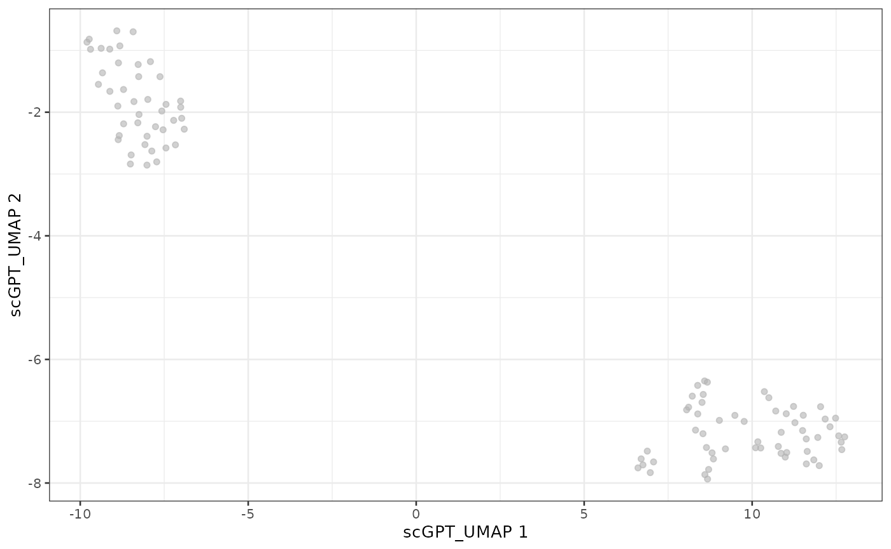

# Running scGPT with fomo

## Introduction

This vignette demonstrates how to use `Run_scGPT` to embed single-cell
RNA-seq data using the scGPT model(Cui et al. 2024).

scGPT is a foundation model for single-cell mRNA-Seq data. scGPT can be
used in many different context and strategies (see their official
[github](https://github.com/bowang-lab/scGPT) repository). In
particular, scGPT provides multiple possible pretrained models which are
linked to in their [github
README](https://github.com/bowang-lab/scGPT/blob/main/README.md). The
models differ based on the training data used. The most common choice of
model is the whole-human
[`scGPT_human`](https://drive.google.com/drive/folders/1oWh_-ZRdhtoGQ2Fw24HP41FgLoomVo-y),
which is trained 33 million normal human cells across a range of tissue
types. Tissue-type specific models are available. There is also a
“continual pretrained model”,
[`scGPT_CP`](https://drive.google.com/drive/folders/1_GROJTzXiAV8HB4imruOTk6PEGuNOcgB)
that inherits the pre-trained scGPT whole-human model, and was further
supervised by extra cell type labels (using the Tabula Sapiens dataset).

In `Run_scGPT` we run a basic “zero-shot” embedding of the data via the
`scg.tasks.embed_data()` function in the `scgpt` python package.
“Zero-shot” means that the input data is run through the pretrained
model, and the output embeddings are returned. Depending on which model
is used, this could correspond to the [zero-shot tutorials of
scGPT](https://github.com/bowang-lab/scGPT/tree/main/tutorials/zero-shot).
Those tutorials also provide strategies for how to use these to perform
integration of datasets.

### Huggingface

scGPT also provides access to their model [huggingface
model](https://huggingface.co/tdc/scGPT). We do not currently provide
implementation of this model, since scGPT offers many more models than
just that available on huggingface. We have focused on an implementation
that allows users the ability to work with and compare these many
different models. However, this means users must download the models and
store them in a local directory for `Run_scGPT`.

## Prerequisites

`Run_scGPT` takes a `.h5ad` filename containing the cell transcripts
data and a pretrained scGPT model directory as input, and returns a
matrix of cell embeddings. We cache all files in a dedicated `model_dir`
folder.

``` r

library(googledrive)
library(tools)
drive_deauth()

# create cache for fomo data
model_dir <- tools::R_user_dir("fomo/scgpt", which = "cache")
dir.create(model_dir, recursive = TRUE, showWarnings = FALSE)
```

### Input data

The input `.h5ad` file used in this vignette is the example data
provided by scGPT (batch_covid_subsampled_train.h5ad
)\[<https://github.com/bowang-lab/scGPT/blob/main/tutorials/zero-shot/Tutorial_ZeroShot_Reference_Mapping.ipynb>\],
but we have subsetted to the first 100 cells so that it will run
instantaneously even on a CPU, which we provide in a google drive and
download the h5ad file from this location.

``` r

url <- "https://drive.google.com/file/d/1Do7CXaaSTwEySGWHMKAkpN5G_g-OY8y2"
folder_id <- googledrive::as_id(url)
files <- drive_get(folder_id)
h5ad_file <- file.path(model_dir, files[1,]$name)
if(!file.exists(h5ad_file))
  drive_download(files[1,], path = h5ad_file)
```

    ## File downloaded:

    ## • batch_covid_subsampled_test_100cells.h5ad
    ##   <id: 1Do7CXaaSTwEySGWHMKAkpN5G_g-OY8y2>

    ## Saved locally as:

    ## • /home/runner/.cache/R/fomo/scgpt/batch_covid_subsampled_test_100cells.h5ad

### Model weights

The pretrained scGPT model directory that we use is `scGPT_human` model
which can be downloaded from a google drive provided in
<https://github.com/bowang-lab/scGPT>. The model directory should
contain a `.pt` file with the model weights, along with `vocab.json` and
`args.json`.

``` r

url <- "https://drive.google.com/drive/folders/1oWh_-ZRdhtoGQ2Fw24HP41FgLoomVo-y"
folder_id <- googledrive::as_id(url)
files <- drive_ls(drive_get(folder_id), recursive = TRUE)
for (i in seq_along(files)){
  path <- file.path(model_dir, files[i,]$name)
  if(!file.exists(path))
    drive_download(files[i,], path = path)
}
```

    ## File downloaded:

    ## • vocab.json <id: 1H3E_MJ-Dl36AQV6jLbna2EdvgPaqvqcC>

    ## Saved locally as:

    ## • /home/runner/.cache/R/fomo/scgpt/vocab.json

    ## File downloaded:

    ## • args.json <id: 1hh2zGKyWAx3DyovD30GStZ3QlzmSqdk1>

    ## Saved locally as:

    ## • /home/runner/.cache/R/fomo/scgpt/args.json

    ## File downloaded:

    ## • best_model.pt <id: 14AebJfGOUF047Eg40hk57HCtrb0fyDTm>

    ## Saved locally as:

    ## • /home/runner/.cache/R/fomo/scgpt/best_model.pt

``` r

list.files(model_dir)
```

    ## [1] "args.json"                                
    ## [2] "batch_covid_subsampled_test_100cells.h5ad"
    ## [3] "best_model.pt"                            
    ## [4] "vocab.json"

## Running scGPT

Run `Run_scGPT` to embed the cells given the path to the h5ad file on
disk `h5ad_file` and the mode directory `model_dir`. The result is a
matrix with one row per cell and one column per embedding dimension:

``` r

library(fomo)
library(anndataR)
result <- Run_scGPT(
    h5ad_file = h5ad_file,
    model_dir  = model_dir,
    gene_col   = "gene_name"
)
```

    ## Using Python: /home/runner/.pyenv/versions/3.12.13/bin/python3.12
    ## Creating virtual environment '/home/runner/.cache/R/basilisk/1.24.0/fomo/0.1.0/scgpt' ...

    ## + /home/runner/.pyenv/versions/3.12.13/bin/python3.12 -m venv /home/runner/.cache/R/basilisk/1.24.0/fomo/0.1.0/scgpt

    ## Done!
    ## Installing packages: pip, wheel, setuptools

    ## + /home/runner/.cache/R/basilisk/1.24.0/fomo/0.1.0/scgpt/bin/python -m pip install --upgrade pip wheel setuptools

    ## Installing packages: 'scgpt==0.2.4', 'torch==2.2.0', 'ipython==9.12.0', 'numpy==1.26.4'

    ## + /home/runner/.cache/R/basilisk/1.24.0/fomo/0.1.0/scgpt/bin/python -m pip install --upgrade --no-user 'scgpt==0.2.4' 'torch==2.2.0' 'ipython==9.12.0' 'numpy==1.26.4'

    ## Virtual environment '/home/runner/.cache/R/basilisk/1.24.0/fomo/0.1.0/scgpt' successfully created.
    ## scGPT - INFO - match 1173/1200 genes in vocabulary of size 60697.

``` r

dim(result)
```

    ## [1] 100 512

The resulting embedding of scGPT will still be of high dimensions, we
can further reduce the dimensionality with PCA and UMAP.

``` r

library(scrapper)

# reduce with PCA
result_pca <- runPca(t(result), number = 30, scale = TRUE)
result_pca <- result_pca$components

# reduce with UMAP
result_umap <- runUmap(result_pca)
```

Now we can add this new embeddings to a SingleCellExperiment generated
from the same h5ad file.

``` r

library(SingleCellExperiment)
```

    ## Loading required package: SummarizedExperiment

    ## Loading required package: MatrixGenerics

    ## Loading required package: matrixStats

    ## 
    ## Attaching package: 'MatrixGenerics'

    ## The following objects are masked from 'package:matrixStats':
    ## 
    ##     colAlls, colAnyNAs, colAnys, colAvgsPerRowSet, colCollapse,
    ##     colCounts, colCummaxs, colCummins, colCumprods, colCumsums,
    ##     colDiffs, colIQRDiffs, colIQRs, colLogSumExps, colMadDiffs,
    ##     colMads, colMaxs, colMeans2, colMedians, colMins, colOrderStats,
    ##     colProds, colQuantiles, colRanges, colRanks, colSdDiffs, colSds,
    ##     colSums2, colTabulates, colVarDiffs, colVars, colWeightedMads,
    ##     colWeightedMeans, colWeightedMedians, colWeightedSds,
    ##     colWeightedVars, rowAlls, rowAnyNAs, rowAnys, rowAvgsPerColSet,
    ##     rowCollapse, rowCounts, rowCummaxs, rowCummins, rowCumprods,
    ##     rowCumsums, rowDiffs, rowIQRDiffs, rowIQRs, rowLogSumExps,
    ##     rowMadDiffs, rowMads, rowMaxs, rowMeans2, rowMedians, rowMins,
    ##     rowOrderStats, rowProds, rowQuantiles, rowRanges, rowRanks,
    ##     rowSdDiffs, rowSds, rowSums2, rowTabulates, rowVarDiffs, rowVars,
    ##     rowWeightedMads, rowWeightedMeans, rowWeightedMedians,
    ##     rowWeightedSds, rowWeightedVars

    ## Loading required package: GenomicRanges

    ## Loading required package: stats4

    ## Loading required package: BiocGenerics

    ## Loading required package: generics

    ## 
    ## Attaching package: 'generics'

    ## The following objects are masked from 'package:base':
    ## 
    ##     as.difftime, as.factor, as.ordered, intersect, is.element, setdiff,
    ##     setequal, union

    ## 
    ## Attaching package: 'BiocGenerics'

    ## The following objects are masked from 'package:stats':
    ## 
    ##     IQR, mad, sd, var, xtabs

    ## The following objects are masked from 'package:base':
    ## 
    ##     anyDuplicated, aperm, append, as.data.frame, basename, cbind,
    ##     colnames, dirname, do.call, duplicated, eval, evalq, Filter, Find,
    ##     get, grep, grepl, is.unsorted, lapply, Map, mapply, match, mget,
    ##     order, paste, pmax, pmax.int, pmin, pmin.int, Position, rank,
    ##     rbind, Reduce, rownames, sapply, saveRDS, table, tapply, unique,
    ##     unsplit, which.max, which.min

    ## Loading required package: S4Vectors

    ## 
    ## Attaching package: 'S4Vectors'

    ## The following object is masked from 'package:utils':
    ## 
    ##     findMatches

    ## The following objects are masked from 'package:base':
    ## 
    ##     expand.grid, I, unname

    ## Loading required package: IRanges

    ## Loading required package: Seqinfo

    ## Loading required package: Biobase

    ## Welcome to Bioconductor
    ## 
    ##     Vignettes contain introductory material; view with
    ##     'browseVignettes()'. To cite Bioconductor, see
    ##     'citation("Biobase")', and for packages 'citation("pkgname")'.

    ## 
    ## Attaching package: 'Biobase'

    ## The following object is masked from 'package:MatrixGenerics':
    ## 
    ##     rowMedians

    ## The following objects are masked from 'package:matrixStats':
    ## 
    ##     anyMissing, rowMedians

``` r

sce <- anndataR::read_h5ad(h5ad_file, as = "SingleCellExperiment")

reducedDim(sce, "scGPT") <- result
reducedDim(sce, "scGPT_PCA") <- t(result_pca)
reducedDim(sce, "scGPT_UMAP") <- result_umap

library(scater)
```

    ## Loading required package: scuttle

    ## 
    ## Attaching package: 'scuttle'

    ## The following objects are masked from 'package:scrapper':
    ## 
    ##     aggregateAcrossCells, normalizeCounts

    ## Loading required package: ggplot2

``` r

plotUMAP(sce, dimred = "scGPT_UMAP")
```



## Basic Python script

The basic python script that underlies this function is:

    import scanpy as sc
    import scgpt as scg
    adata = sc.read_h5ad(h5ad_file)

    ref_embed_adata = scg.tasks.embed_data(
        adata,
        model_dir,
        gene_col=gene_col,
        batch_size=64,
    )

There is additional code added to ensure that it runs on MacOS.

## Session Info

``` r

sessionInfo()
```

    ## R version 4.6.1 (2026-06-24)
    ## Platform: x86_64-pc-linux-gnu
    ## Running under: Ubuntu 24.04.4 LTS
    ## 
    ## Matrix products: default
    ## BLAS:   /usr/lib/x86_64-linux-gnu/openblas-pthread/libblas.so.3 
    ## LAPACK: /usr/lib/x86_64-linux-gnu/openblas-pthread/libopenblasp-r0.3.26.so;  LAPACK version 3.12.0
    ## 
    ## locale:
    ##  [1] LC_CTYPE=C.UTF-8       LC_NUMERIC=C           LC_TIME=C.UTF-8       
    ##  [4] LC_COLLATE=C.UTF-8     LC_MONETARY=C.UTF-8    LC_MESSAGES=C.UTF-8   
    ##  [7] LC_PAPER=C.UTF-8       LC_NAME=C              LC_ADDRESS=C          
    ## [10] LC_TELEPHONE=C         LC_MEASUREMENT=C.UTF-8 LC_IDENTIFICATION=C   
    ## 
    ## time zone: UTC
    ## tzcode source: system (glibc)
    ## 
    ## attached base packages:
    ## [1] stats4    tools     stats     graphics  grDevices utils     datasets 
    ## [8] methods   base     
    ## 
    ## other attached packages:
    ##  [1] scater_1.40.1               ggplot2_4.0.3              
    ##  [3] scuttle_1.22.0              SingleCellExperiment_1.34.0
    ##  [5] SummarizedExperiment_1.42.0 Biobase_2.72.0             
    ##  [7] GenomicRanges_1.64.0        Seqinfo_1.2.0              
    ##  [9] IRanges_2.46.0              S4Vectors_0.50.1           
    ## [11] BiocGenerics_0.58.1         generics_0.1.4             
    ## [13] MatrixGenerics_1.24.0       matrixStats_1.5.0          
    ## [15] scrapper_1.6.3              anndataR_1.2.0             
    ## [17] fomo_0.1.0                  googledrive_2.1.2          
    ## [19] BiocStyle_2.40.0           
    ## 
    ## loaded via a namespace (and not attached):
    ##  [1] tidyselect_1.2.1    viridisLite_0.4.3   vipor_0.4.7        
    ##  [4] dplyr_1.2.1         farver_2.1.2        viridis_0.6.5      
    ##  [7] filelock_1.0.3      S7_0.2.2            fastmap_1.2.0      
    ## [10] rsvd_1.0.5          digest_0.6.39       lifecycle_1.0.5    
    ## [13] magrittr_2.0.5      compiler_4.6.1      rlang_1.2.0        
    ## [16] sass_0.4.10         yaml_2.3.12         knitr_1.51         
    ## [19] labeling_0.4.3      S4Arrays_1.12.0     curl_7.1.0         
    ## [22] reticulate_1.46.0   DelayedArray_0.38.2 RColorBrewer_1.1-3 
    ## [25] abind_1.4-8         BiocParallel_1.46.0 withr_3.0.3        
    ## [28] purrr_1.2.2         desc_1.4.3          grid_4.6.1         
    ## [31] beachmat_2.28.0     Rhdf5lib_2.0.0      scales_1.4.0       
    ## [34] cli_3.6.6           rmarkdown_2.31      ragg_1.5.2         
    ## [37] otel_0.2.0          httr_1.4.8          ggbeeswarm_0.7.3   
    ## [40] cachem_1.1.0        rhdf5_2.56.0        parallel_4.6.1     
    ## [43] BiocManager_1.30.27 XVector_0.52.0      basilisk_1.24.0    
    ## [46] vctrs_0.7.3         Matrix_1.7-5        jsonlite_2.0.0     
    ## [49] dir.expiry_1.20.0   BiocSingular_1.28.0 bookdown_0.47      
    ## [52] BiocNeighbors_2.6.0 ggrepel_0.9.8       beeswarm_0.4.0     
    ## [55] irlba_2.3.7         systemfonts_1.3.2   jquerylib_0.1.4    
    ## [58] glue_1.8.1          pkgdown_2.2.0       codetools_0.2-20   
    ## [61] gtable_0.3.6        ScaledMatrix_1.20.0 tibble_3.3.1       
    ## [64] pillar_1.11.1       rappdirs_0.3.4      htmltools_0.5.9    
    ## [67] rhdf5filters_1.24.0 R6_2.6.1            textshaping_1.0.5  
    ## [70] evaluate_1.0.5      lattice_0.22-9      png_0.1-9          
    ## [73] gargle_1.6.1        bslib_0.11.0        Rcpp_1.1.1-1.1     
    ## [76] gridExtra_2.3.1     SparseArray_1.12.2  xfun_0.59          
    ## [79] fs_2.1.0            pkgconfig_2.0.3

## References

Cui, Haotian, Chloe Wang, Hassaan Maan, et al. 2024. “scGPT: Toward
Building a Foundation Model for Single-Cell Multi-Omics Using Generative
AI.” *Nature Methods* 21: 1470–80.
<https://doi.org/10.1038/s41592-024-02201-0>.
